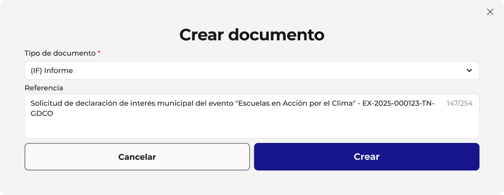
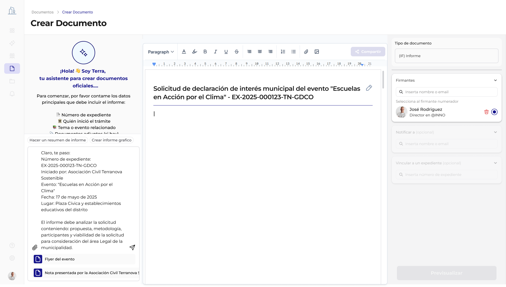
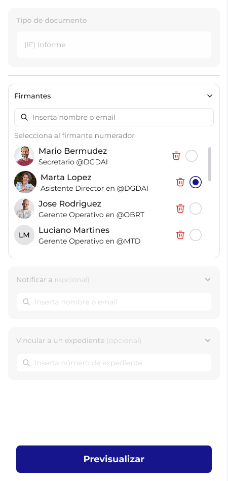
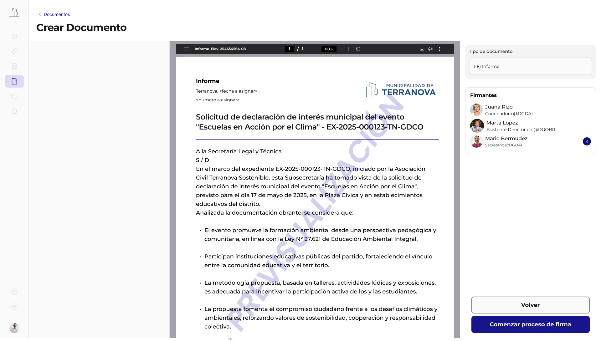

# Flujo de Creación de Documentos Oficiales

## Introducción

El proceso de creación de un documento oficial en GDI es guiado por las configuraciones establecidas previamente en el Backoffice, asegurando que cada documento cumpla con las normativas y requisitos definidos por la municipalidad.

**Un Documento Oficial** es aquel que ha completado exitosamente el proceso de formalización y cuenta con dos elementos que le otorgan **validez legal**:

- 🔢 **Número Oficial**: Identificador único `<TIPO>-<AAAA>-<NNNNNN>-<SIGLA_ECO>-<SIGLA_REPARTICIÓN>`
- ✍️ **Firma del Numerador**: Certificación digital que oficializa el documento

> **Solo los documentos en estado `signed` tienen plena validez legal.**

## Paso 1: Inicio de la Creación, Selección del Tipo de Documento y Definición de Referencia

### Inicio de la Creación

El usuario inicia la creación de un nuevo documento desde su panel de control a través de un botón "Crear" en la pantalla.

### Ventana Modal "Crear documento"

Al iniciar la creación, el sistema presenta una ventana modal donde el usuario debe:

#### 1. Seleccionar el Tipo de Documento

Campo desplegable (Dropdown) que muestra un listado de **tipos de documentos** disponibles en el sistema.



**Listado Dinámico y Filtrado:** Este listado muestra únicamente los tipos de documento que el Super-Administrador habilitó y configuró en Backoffice, sección "Tipo de Documento". Allí también se definen los perfiles (titulares de cada repartición) autorizados para firmar cada uno.

**Ejemplo:** Si el tipo de documento "Decreto" está configurado para firma exclusiva de una repartición "Intendencia", todos los sectores podrán crear un decreto, pero solo el Titular de la repartición habilitada (Intendente) podrá firmarlo.

#### 2. Ingresar la Referencia

El usuario debe ingresar una "Referencia" o "Motivo" para el documento (campo de texto libre, con un contador de caracteres, ej. "36/250"). Este campo es un metadato clave para la identificación inicial del documento.


#### 3. Creación del Documento

Al presionar el botón "Crear" en esta modal, el documento se genera en el sistema con el tipo y referencia especificados, y el usuario es redirigido a la pantalla de edición.

## Paso 2: Edición y Configuración Detallada del Documento

Una vez generado el documento en el Paso 1, el sistema redirige al usuario a la pantalla principal de edición y configuración del nuevo documento.



### Título del Documento

El campo "Referencia" ingresado en la modal se muestra prominentemente como el título principal del documento en esta pantalla, y el usuario puede volver a editarlo.

### Área de Contenido

Se presenta un área central para la carga del contenido del documento.

#### Editor de texto enriquecido

Opciones de formato y barra de herramientas (tamaño, párrafo, negrita, cursiva, subrayado, etc.), permitiendo la redacción de contenido libre.

#### Asistente de IA (Terra)

En el lateral izquierdo, se observa un asistente de IA ("¡Hola!, soy tu asistente para crear documentos oficiales.") que guía al usuario y ofrece funcionalidades como:

- "Vamos a registrar juntos un documento adjunto en el sistema..."
- "Usa el botón central para subir tu archivo..."
- Sugiere información clave a incluir:
  - Número de expediente
  - Quién inicia el trámite
  - Tema o evento relacionado
  - Documentos adjuntos


### Panel Lateral Derecho (Configuración del Documento)

Este panel consolida las configuraciones específicas para el documento actual que fueron pre-determinadas por el tipo de documento seleccionado en el Paso 1.



#### Configuraciones incluidas:

##### Tipo de Documento
Se muestra el tipo de documento seleccionado (ej. "(IFE) Informe de elevación"). Este campo es de solo lectura en esta etapa.

##### Sección para gestionar los firmantes del documento

- **Selección de Firmantes**: campo para insertar usuarios
- **Selección del Firmante Numerador**: campo para "Selecciona al firmante numerador"
- **Notificar a (opcional)**: Campos para avisar a otros usuarios sobre dicho documento una vez finalizado el ciclo de firmas
- **Vincular a un expediente (opcional)**: Campo que permite asociar el documento a un expediente existente una vez finalizado el ciclo de firmas

> **Nota**: La visibilidad y opciones de estos campos están directamente influenciadas por la configuración de "Tipo de Firma" y reglas del numerador configurados en el Backoffice.

## Paso 3: Previsualización e Inicio del Proceso de Firmas

En la parte inferior de la pantalla se encuentra el botón "Previsualizar", que permite al usuario revisar el documento antes de iniciar el proceso de firma.

### Previsualización del Documento

Una vez que el usuario ha completado la redacción o carga del contenido y ha asignado a todos los firmantes y al Numerador, presiona el botón "Previsualizar".

.png)

#### Características de la previsualización:

- El sistema genera una vista previa del documento en formato PDF
- Esta previsualización incluirá un encabezado provisional y una marca de agua "PREVISUALIZACIÓN" para indicar que el documento aún no es oficial
- Incluiría un resumen de AI del contenido del documento desarrollado

> **Nota**: La marca de agua "PREVISUALIZACIÓN" solo está presente en la previsualización antes de la primera firma. Una vez que el primer firmante firma, la marca de agua desaparece, pero el encabezado sigue siendo provisional hasta que el numerador firma y se asignan la fecha y el número oficial.

### Validación e inicio del circuito

Si la previsualización es correcta, el usuario procede a iniciar el proceso de firmas. Si se encuentra dentro de los firmantes y en ese momento le corresponde firmar, procede a firmar.

- GDI realiza las verificaciones finales e inicia el circuito de firmas, orquestando el proceso según el orden y tipo de firma definidos
- El documento pasa al estado `awaiting_signatures` y se notifica en su panel de documentos a los firmantes correspondientes



## Paso 4: Orquestación de Firmas y Numeración Final

### Transición Crítica: `draft` → `awaiting_signatures`

Una vez que el usuario presiona "Iniciar proceso de Firmas", ocurre la transición crítica:

#### Cambios inmediatos:

- **Estado del documento**: `draft` (En Edición) → `awaiting_signatures` (Esperando Firmas)
- **Bloqueo de edición**: El documento se vuelve inmediatamente **no editable** para todos los usuarios
- **Encabezado**: Aparece el encabezado provisional (sin marca de agua "PREVISUALIZACIÓN")
- **Aparición en paneles**: Los firmantes ven el documento en su panel de documentos pendientes


### Estado `firmar_ahora` - Proceso de Firma Secuencial

#### Para firmantes intermedios:

- **Tarea individual**: El documento aparece con estado `firmar_ahora` en su panel personal
- **Estado del documento**: Continúa en `awaiting_signatures` (estado general)
- **Acceso de solo lectura**: Puede revisar el contenido completo, sin capacidad de edición
- **Progresión**: Su tarea individual se completa, el documento avanza al siguiente firmante

### Numerador Final - Transición: `awaiting_signatures` → `signed`

#### El Numerador recibe el estado `firmar_ahora`:

- **Documento general**: Aún en estado `awaiting_signatures`
- **Tarea del numerador**: `firmar_ahora` (última firma del circuito)
- **Responsabilidad dual**: Firmar Y activar la numeración oficial

#### Proceso de numeración y oficialización:

```
Numerador completa su firma → Transición automática del sistema:
Estado: awaiting_signatures → signed (DOCUMENTO OFICIAL)
├── Consulta al servicio OFICIAL NUMBER
├── Recibe número correspondiente
├── Asigna fecha_oficial (timestamp de esta firma)
└── Renderiza encabezado oficial definitivo
```

### Estado Final `signed` - Documento Oficial

✅ **EL DOCUMENTO ES AHORA OFICIALMENTE VÁLIDO**

#### Cambios instantáneos:

- **Estado**: `awaiting_signatures` → `signed` (Firmado - OFICIAL)
- **Número oficial**: Asignado permanentemente por el sistema
- **Fecha oficial**: Timestamp exacto de la firma del numerador
- **Encabezado**: Versión oficial definitiva
- **Funcionalidades habilitadas**: Descarga, impresión, búsqueda por número oficial, vinculación automática a expediente (si se configuró)

## Casos Especiales

### Rechazo de Documentos

**Comportamiento:** Cualquier firmante puede rechazar un documento en cualquier momento del proceso

**Resultado:** El documento regresa automáticamente al estado "En Edición"

**Acción posterior:** El creador puede realizar correcciones y reiniciar el proceso completo

**Registro:** Se mantiene auditoría del motivo del rechazo

## Enlaces Relacionados

- [Estados y Transiciones Detalladas](./03-estados-transiciones.md)
- [Numeración y Nomenclatura](./04-numeracion-nomenclatura.md)
- [Introducción y Casos de Uso](./01-introduccion-casos-uso.md)