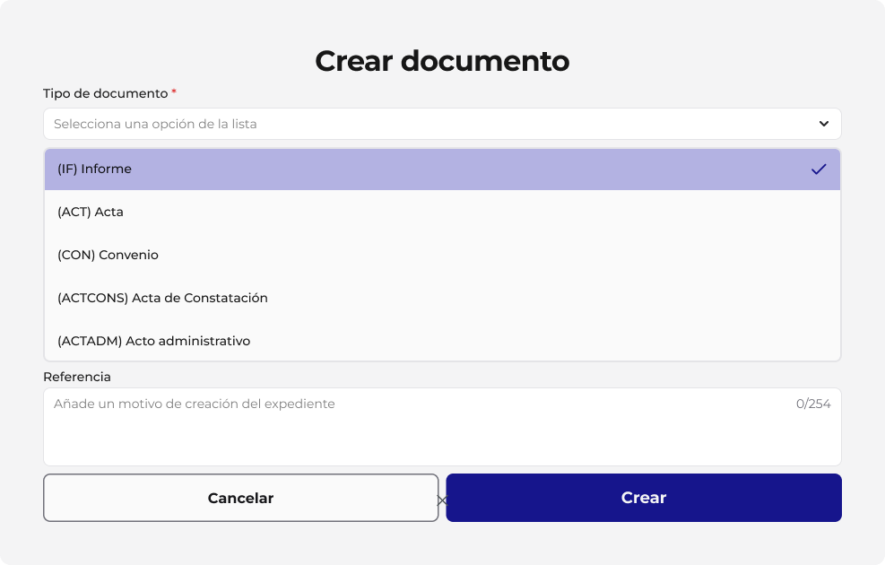
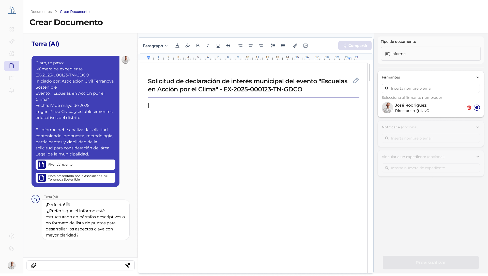
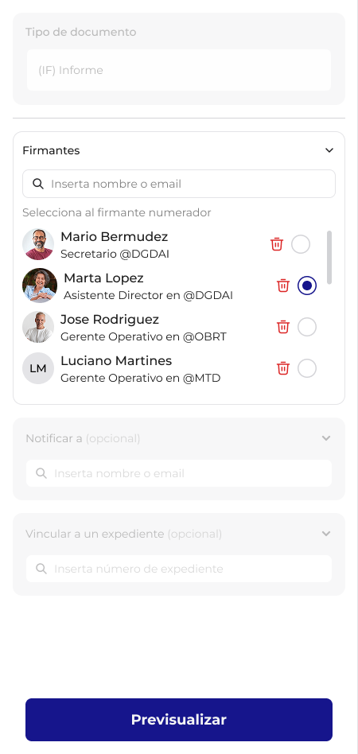

# 🔄 Flujo de Creación de Documentos Oficiales - Implementación Real

El proceso de creación de un documento oficial en GDI es guiado por las configuraciones establecidas previamente en el Backoffice, asegurando que cada documento cumpla con las normativas y requisitos definidos por la municipalidad.

## 📋 Definición de Documento Oficial

Un **Documento Oficial** es aquel que ha completado exitosamente el proceso de formalización y cuenta con dos elementos que le otorgan validez legal:

- **🔢 Número Oficial**: Identificador único `<TIPO>-<AAAA>-<NNNNNN>-<SIGLA_ECO>-<SIGLA_DEPARTMENT>`
- **✍️ Firma del Numerador**: Certificación digital que oficializa el documento

**Solo los documentos en estado `signed` tienen plena validez legal.**

## 🏗️ Arquitectura del Flujo

### Estados Principales Implementados

```sql
CREATE TYPE document_status AS ENUM (
    'draft',        -- En edición colaborativa
    'sent_to_sign', -- Enviado al circuito de firmas
    'signed',       -- Firmado y oficial
    'rejected',     -- Rechazado por algún firmante
    'cancelled',    -- Cancelado antes de completar
    'archived'      -- Archivado después de firmado
);
```

### Flujo General

```
📝 CREACIÓN → 👥 COLABORACIÓN → 📤 ENVÍO → ✍️ FIRMAS → 🔢 NUMERACIÓN → ✅ OFICIALIZACIÓN
```

---

## 📝 PASO 1: Creación e Inicialización

### 1.1 Inicio de la Creación

El usuario inicia la creación desde su panel de control mediante el botón **"Crear Documento"**.

**Acción en BD:**
```sql
-- Se prepara para crear nuevo registro en document_draft
```

### 1.2 Modal "Crear Documento"

Al iniciar, el sistema presenta una ventana modal donde el usuario debe:


#### A. Seleccionar Tipo de Documento y Referencia




🎨 **Flujo en Figma:** [Crea documento pop up](https://www.figma.com/design/Q7vt8OkQcbp53kO4SGGUu1/Documentos?node-id=27-33693&t=sAnWdwFCpjvgUy2t-4)

**Campo**: Dropdown dinámico  
**Fuente**: `document_types` WHERE `is_active = true`

```sql
SELECT dt.document_type_id, dt.name, dt.acronym 
FROM document_types dt
JOIN enabled_document_types_by_department edtd 
  ON dt.document_type_id = edtd.document_type_id
WHERE edtd.department_id = [USER_DEPARTMENT_ID]
  AND dt.is_active = true;
```

**Filtrado Dinámico**: Solo muestra tipos habilitados para el department del usuario según configuración del Backoffice.

#### B. Ingresar Referencia

**Campo**: `reference` (TEXT, obligatorio)  
**Límite**: 254 caracteres  
**Propósito**: Motivo o justificación del documento

#### C. Creación del Registro

```sql
INSERT INTO document_draft (
    document_type_id,
    created_by,
    reference,
    content,
    status,
    pad_id
) VALUES (
    ?, -- tipo seleccionado
    ?, -- usuario actual
    ?, -- referencia ingresada
    '{}', -- contenido JSON vacío
    'draft',
    ? -- pad_id único generado
);
```

**Resultado**: Usuario redirigido a pantalla de edición con `document_id` generado.

---

## 👥 PASO 2: Edición Colaborativa

### 2.1 Pantalla Principal de Edición


### 2.2 Editor Colaborativo en Tiempo Real

**Concepto `pad_id`**:
- Identificador único para sesión colaborativa
- Permite edición simultánea de múltiples usuarios
- Sincronización automática de cambios
- Historial de versiones durante edición

#### Funcionalidades del Editor

🎨 **Flujo en Figma:** [Editor de texto enriquecido](https://www.figma.com/design/Q7vt8OkQcbp53kO4SGGUu1/Documentos?node-id=27-39476&t=sAnWdwFCpjvgUy2t-4)
🎨 **Flujo en Figma:** [Guardar y cargar documento](https://www.figma.com/design/Q7vt8OkQcbp53kO4SGGUu1/Documentos?node-id=27-39864&t=sAnWdwFCpjvgUy2t-4)

1. **📝 Editor de Texto Enriquecido**
   - Formato: negrita, cursiva, subrayado
   - Listas, tablas, imágenes
   - Guardado automático cada 30 segundos

2. **👥 Indicadores de Presencia**
   - Cursores de otros editores en tiempo real
   - Lista de usuarios conectados
   - Historial de cambios por usuario

3. **🔄 Sincronización**
   - WebSocket para cambios instantáneos
   - Resolución automática de conflictos
   - Respaldo en `content` (JSONB)

### 2.3 Asistente de IA (Terra)

**Ubicación**: Panel lateral izquierdo  
**Funcionalidades**:
- Sugerencias de contenido basadas en tipo de documento
- Generación automática de referencias legales
- Análisis de consistencia del texto
- Recomendaciones de mejora



### 2.4 Panel de Configuración (Lateral Derecho)



#### Configuraciones Incluidas:

**A. Tipo de Documento** (Solo lectura)
- Muestra el tipo seleccionado en paso 1
- No editable para mantener consistencia

**B. Gestión de Firmantes**

🎨 **Flujo en Figma:** [Seleccion de firmantes](https://www.figma.com/design/Q7vt8OkQcbp53kO4SGGUu1/Documentos?node-id=27-41064&t=sAnWdwFCpjvgUy2t-4)
🎨 **Flujo en Figma:** [Previsualizar firmantes](https://www.figma.com/design/Q7vt8OkQcbp53kO4SGGUu1/Documentos?node-id=27-41862&t=sAnWdwFCpjvgUy2t-4)

```sql
-- Se configuran en document_signers
INSERT INTO document_signers (
    document_id,
    user_id,
    signing_order,
    is_numerator,
    status
) VALUES (?, ?, ?, ?, 'pending');
```

**C. Selección del Numerador**

🎨 **Flujo en Figma:** [Seleccion de numerador](https://www.figma.com/design/Q7vt8OkQcbp53kO4SGGUu1/Documentos?node-id=27-40845&t=sAnWdwFCpjvgUy2t-4)

- Campo especial para usuario que asignará número oficial
- Solo usuarios con permisos según `document_types_allowed_by_rank`

**D. Notificaciones (Opcional)**
- Usuarios a notificar al completar el proceso
- Sin permisos de firma, solo informativo

**E. Vinculación a Expediente (Opcional)**
- Campo para asociar documento a expediente existente
- Se ejecuta automáticamente al finalizar firmas

---

## 📤 PASO 3: Previsualización e Inicio del Circuito

### 3.1 Generación de Previsualización

**Trigger**: Usuario presiona botón "Previsualizar"
.png)

**Proceso**:
1. Validación de contenido obligatorio
2. Verificación de firmantes asignados
3. Generación de PDF temporal con encabezado provisional
4. Aplicación de marca de agua "PREVISUALIZACIÓN"


🎨 **Flujo en Figma:** [Previsualización de documentos PDF](https://www.figma.com/design/Q7vt8OkQcbp53kO4SGGUu1/Documentos?node-id=27-40432&t=sAnWdwFCpjvgUy2t-4)

### 3.2 Validaciones Pre-Envío

```sql
-- Validaciones requeridas antes de envío
SELECT 
    CASE 
        WHEN reference IS NULL OR reference = '' THEN 'ERROR: Referencia obligatoria'
        WHEN content = '{}' THEN 'ERROR: Contenido vacío'
        WHEN NOT EXISTS (
            SELECT 1 FROM document_signers 
            WHERE document_id = ? AND is_numerator = true
        ) THEN 'ERROR: Numerador no asignado'
        ELSE 'VALID'
    END as validation_status
FROM document_draft 
WHERE document_id = ?;
```

### 3.3 Inicio del Circuito de Firmas

**Acción**: Usuario confirma "Iniciar Proceso de Firmas"

**Transición Crítica**: `draft` → `sent_to_sign`

```sql
UPDATE document_draft 
SET 
    status = 'sent_to_sign',
    sent_to_sign_at = NOW(),
    sent_by = ?,
    last_modified_at = NOW()
WHERE document_id = ?;
```

**Efectos Inmediatos**:
- ✅ Contenido se vuelve **inmutable**
- ✅ Aparece encabezado provisional (sin marca "PREVISUALIZACIÓN")
- ✅ Firmantes reciben notificaciones
- ✅ Documento aparece en paneles de firmantes

---

## ✍️ PASO 4: Proceso de Firmas Secuencial

🎨 **Flujo en Figma:** [Flujo de firmas](https://www.figma.com/design/Q7vt8OkQcbp53kO4SGGUu1/Documentos?node-id=27-42221&t=sAnWdwFCpjvgUy2t-4)
🎨 **Flujo en Figma:** [Vista de firmas](https://www.figma.com/design/Q7vt8OkQcbp53kO4SGGUu1/Documentos?node-id=27-43811&t=sAnWdwFCpjvgUy2t-4)
🎨 **Flujo en Figma:** [Estampado de firma simulada](https://www.figma.com/design/Q7vt8OkQcbp53kO4SGGUu1/Documentos?node-id=27-44342&t=sAnWdwFCpjvgUy2t-4)
🎨 **Flujo en Figma:** [Feedback para usuarios y estados de turnos](https://www.figma.com/design/Q7vt8OkQcbp53kO4SGGUu1/Documentos?node-id=27-45316&t=sAnWdwFCpjvgUy2t-4)

### 4.1 Orquestación de Firmas

**Sistema**: Signing Workflow Orchestrator  
**Lógica**: Basada en `signing_order` en tabla `document_signers`

### 4.2 Estado Individual de Firmantes

```sql
-- Cada firmante tiene su propio estado
CREATE TYPE document_signer_status AS ENUM (
    'pending',   -- Esperando su turno
    'signed',    -- Ya firmó
    'rejected'   -- Rechazó el documento
);
```

### 4.3 Flujo para Firmante Intermedio

**Notificación**: "Documento pendiente de firma"  
**Estado Personal**: `pending` → `signed`  
**Estado Documento**: Permanece `sent_to_sign`

#### Acciones del Firmante:

1. **👀 Revisar Contenido** (Solo lectura)
2. **✅ Firmar** o **❌ Rechazar**
3. **📝 Agregar Observaciones** (Opcional)

```sql
-- Si firma:
UPDATE document_signers 
SET 
    status = 'signed',
    signed_at = NOW(),
    observations = ?
WHERE document_signer_id = ?;

-- Si rechaza:
INSERT INTO document_rejections (
    document_id,
    rejected_by,
    reason,
    rejected_at
) VALUES (?, ?, ?, NOW());

UPDATE document_draft 
SET status = 'rejected' 
WHERE document_id = ?;
```

### 4.4 Gestión de Rechazos

**Trigger**: Firmante selecciona "Rechazar"

🎨 **Flujo en Figma:** [Rechazar firma](https://www.figma.com/design/Q7vt8OkQcbp53kO4SGGUu1/Documentos?node-id=27-47878&t=sAnWdwFCpjvgUy2t-4)

**Proceso**:
1. Registro en `document_rejections` con motivo
2. Cambio de estado documento a `rejected`
3. Notificación a creador y equipo
4. Habilitación de proceso de corrección

---

## 🔢 PASO 5: Numeración Final (Numerador)

🎨 **Flujo en Figma:** [Firma del numerador](https://www.figma.com/design/Q7vt8OkQcbp53kO4SGGUu1/Documentos?node-id=27-46252&t=sAnWdwFCpjvgUy2t-4)

### 5.1 Identificación del Numerador

**Usuario Especial**: `is_numerator = true` en `document_signers`  
**Responsabilidad**: Firma final + asignación de número oficial

### 5.2 Proceso de Numeración

#### A. Reserva de Número

```sql
INSERT INTO numeration_requests (
    document_type_id,
    user_id,
    department_id,
    year,
    reserved_number,
    reserved_at,
    validation_status
) VALUES (
    ?,
    ?, -- numerador
    ?, -- department
    EXTRACT(YEAR FROM NOW()),
    ?, -- número generado secuencialmente
    NOW(),
    'pending'
);
```

#### B. Generación de Número Oficial

**Formato**: `<TIPO>-<AAAA>-<NNNNNN>-<SIGLA_ECO>-<SIGLA_DEPARTMENT>`

```sql
-- Ejemplo: DECRE-2025-000123-TN-INTEN
SELECT 
    CONCAT(
        dt.acronym, '-',
        EXTRACT(YEAR FROM NOW()), '-',
        LPAD(CAST(nr.reserved_number AS TEXT), 6, '0'), '-',
        m.acronym, '-',
        d.acronym
    ) as official_number
FROM document_types dt
JOIN numeration_requests nr ON dt.document_type_id = nr.document_type_id
JOIN departments d ON nr.department_id = d.department_id
JOIN municipalities m ON d.municipality_id = m.id_municipality
WHERE nr.numeration_requests_id = ?;
```

### 5.3 Transición Final: `sent_to_sign` → `signed`

**Trigger**: Numerador completa su firma

```sql
BEGIN TRANSACTION;

-- 1. Actualizar firmante numerador
UPDATE document_signers 
SET status = 'signed', signed_at = NOW()
WHERE document_signer_id = ? AND is_numerator = true;

-- 2. Confirmar numeración
UPDATE numeration_requests 
SET is_confirmed = true, confirmed_at = NOW(), validation_status = 'valid'
WHERE numeration_requests_id = ?;

-- 3. Crear documento oficial
INSERT INTO official_documents (
    document_id,
    document_type_id,
    numeration_requests_id,
    reference,
    content,
    official_number,
    year,
    department_id,
    numerator_id,
    signed_at,
    signed_pdf_url,
    signers
) VALUES (?, ?, ?, ?, ?, ?, ?, ?, ?, NOW(), ?, ?);

-- 4. Finalizar documento draft
UPDATE document_draft 
SET status = 'signed' 
WHERE document_id = ?;

COMMIT;
```

---

## ✅ PASO 6: Oficialización y Post-Firma

### 6.1 Documento Oficialmente Válido

**Estado Final**: `signed`  
**Ubicación**: Tanto en `document_draft` como en `official_documents`

### 6.2 Cambios Instantáneos Post-Firma

- ✅ **Número oficial**: Asignado permanentemente
- ✅ **Fecha oficial**: Timestamp exacto de firma del numerador
- ✅ **PDF firmado**: Generado y almacenado en `signed_pdf_url`
- ✅ **Encabezado definitivo**: Sin marcas de agua, con datos oficiales

### 6.3 Funcionalidades Habilitadas

1. **📥 Descarga**: PDF firmado oficial
2. **🖨️ Impresión**: Con encabezado definitivo
3. **🔍 Búsqueda**: Por número oficial
4. **🔗 Vinculación**: Automática a expediente (si configurado)
5. **📊 Reportes**: Inclusión en estadísticas oficiales

---

## 🔄 Flujos de Excepción

### 1. Proceso de Corrección (Documento Rechazado)

```
rejected → draft (edición) → sent_to_sign → signed
```

**Pasos**:
1. Usuario revisa motivos en `document_rejections`
2. Reactiva editor colaborativo
3. Realiza correcciones necesarias
4. Reenvía a circuito (nuevo ciclo)

### 2. Cancelación de Documento

**Trigger**: Antes de completar todas las firmas  
**Estado**: `cancelled`

```sql
UPDATE document_draft 
SET status = 'cancelled' 
WHERE document_id = ? AND status IN ('draft', 'sent_to_sign');
```

### 3. Eliminación Lógica

**Implementación**: `is_deleted = true`  
**Preserva**: Integridad histórica y auditoría

```sql
UPDATE document_draft 
SET is_deleted = true 
WHERE document_id = ? AND status = 'draft';
```

---

## 📊 Diagramas de Secuencia

### Flujo Completo de Creación

```mermaid
sequenceDiagram
    participant U as Usuario
    participant S as Sistema
    participant DB as Base de Datos
    participant F as Firmantes
    participant N as Numerador

    U->>S: Crear Documento
    S->>DB: INSERT document_draft (draft)
    U->>S: Edición Colaborativa
    S->>DB: UPDATE content (pad_id)
    U->>S: Configurar Firmantes
    S->>DB: INSERT document_signers
    U->>S: Enviar a Firma
    S->>DB: UPDATE status = 'sent_to_sign'
    S->>F: Notificar Firmantes
    F->>S: Firmar Secuencial
    S->>DB: UPDATE signers status
    F->>N: Último Firmante (Numerador)
    N->>S: Numeración Final
    S->>DB: INSERT official_documents
    S->>DB: UPDATE status = 'signed'
```

---

## 🛡️ Validaciones y Controles

### Validaciones de Negocio

1. **📝 Contenido Obligatorio**: `reference` y `content` no pueden estar vacíos
2. **👥 Numerador Único**: Solo un firmante con `is_numerator = true`
3. **🔢 Orden Secuencial**: `signing_order` debe ser consecutivo
4. **🏛️ Permisos Department**: Validación contra `enabled_document_types_by_department`

### Controles de Integridad

1. **🔐 Estado Inmutable**: Contenido bloqueado en `sent_to_sign`
2. **📊 Numeración Única**: Constraint en `official_documents.official_number`
3. **🕒 Timestamps**: Auditoría completa de tiempos
4. **🔄 Transiciones Válidas**: Solo cambios de estado permitidos

---

## 📈 Métricas y Monitoreo

### KPIs del Proceso

1. **⏱️ Tiempo Promedio**: Desde `draft` hasta `signed`
2. **❌ Tasa de Rechazos**: Por tipo de documento y department
3. **👥 Colaboración**: Usuarios promedio por documento
4. **🔄 Correcciones**: Iteraciones promedio por documento

### Alertas del Sistema

1. **⏰ Timeouts**: Firmas pendientes por más de X días
2. **🚫 Rechazos Frecuentes**: Mismos motivos repetidos
3. **📊 Volumen Anómalo**: Picos inusuales de creación
4. **⚠️ Errores Técnicos**: Fallos en numeración o PDF

---
