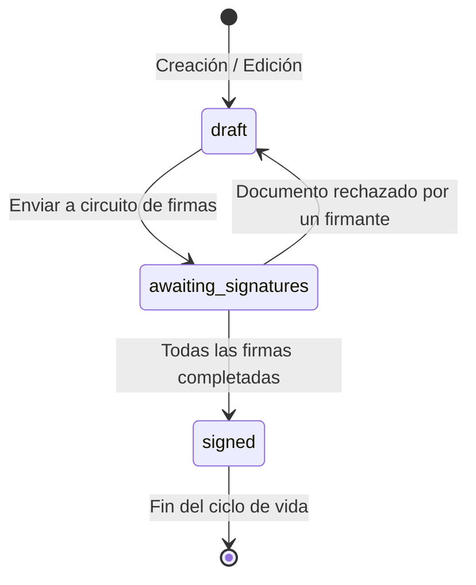
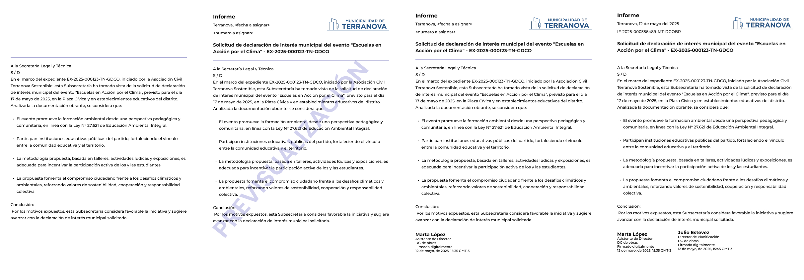

# Estados y Transiciones de Documentos

## Sistema de Estados y Transiciones

| **Estado** | **Descripción** |
|------------|-----------------|
| **En Edición (draft)** | Editable, sin encabezado definitivo |
| **Esperando Firmas (awaiting_signatures)** | En circuito de firmas, encabezado provisional |
| **Firmar Ahora (firmar_ahora)** | Tarea activa para el firmante actual |
| **Firmado (signed)** | Finalizado, solo lectura, encabezado oficial, número y fecha asignados |

## Flujo de Estados

### 1. En Edición (draft)

- **Estado inicial**: El contenido es editable por el creador y usuarios con permisos de edición
- **Visualización**: Los encabezados de Fecha y número muestran `<A Asignar>`
- **Acciones permitibles**:
  - ✅ Editar contenido
  - ✅ Asignar firmantes
  - ✅ Compartir con otros usuarios
  - ✅ Previsualizar

### 2. Esperando Firmas (awaiting_signatures)

- **Estado de circuito**: El documento ha sido enviado al circuito de firmas y está a la espera de que los firmantes asignados completen su acción
- **Visualización**: Se muestra un encabezado provisional con indicadores visuales de los firmantes y su estado
- **Características**:
  - 🔒 **Inmutable**: El contenido NO puede editarse
  - 👥 **Visible**: Aparece en panel de firmantes
  - 📄 **Encabezado**: Provisional sin datos oficiales

### 3. Firmar Ahora (firmar_ahora)

- **Tarea individual**: Generada por el Signing Workflow Orchestrator cuando el turno de firma de un usuario específico ha llegado
- **Estado subyacente**: El documento sigue en `awaiting_signatures`
- **Acciones del firmante**:
  - ✅ Revisar contenido (solo lectura)
  - ✅ Firmar documento
  - ❌ Rechazar documento (devuelve a `draft`)

### 4. Firmado (signed)

- **Estado final**: El documento ha completado exitosamente todo su circuito de firmas
- **Activación**: Cuando el Numerador realiza su firma
- **Cambios automáticos**:
  - 🔢 Asignación de `fecha_oficial` (timestamp de firma del numerador)
  - 📋 Generación de `numero_oficial` único
  - 🔒 Documento de solo lectura permanente
- **Visualización**: Encabezado definitivo con toda la información oficial

# Estados y Transiciones de Documentos

## Sistema de Estados y Transiciones

| **Estado** | **Descripción** |
|------------|-----------------|
| **En Edición (draft)** | Editable, sin encabezado definitivo |
| **Esperando Firmas (awaiting_signatures)** | En circuito de firmas, encabezado provisional |
| **Firmar Ahora (firmar_ahora)** | Tarea activa para el firmante actual |
| **Firmado (signed)** | Finalizado, solo lectura, encabezado oficial, número y fecha asignados |

## Flujo de Estados

### 1. En Edición (draft)

- **Estado inicial**: El contenido es editable por el creador y usuarios con permisos de edición
- **Visualización**: Los encabezados de Fecha y número muestran `<A Asignar>`
- **Acciones permitibles**:
  - ✅ Editar contenido
  - ✅ Asignar firmantes
  - ✅ Compartir con otros usuarios
  - ✅ Previsualizar

### 2. Esperando Firmas (awaiting_signatures)

- **Estado de circuito**: El documento ha sido enviado al circuito de firmas y está a la espera de que los firmantes asignados completen su acción
- **Visualización**: Se muestra un encabezado provisional con indicadores visuales de los firmantes y su estado
- **Características**:
  - 🔒 **Inmutable**: El contenido NO puede editarse
  - 👥 **Visible**: Aparece en panel de firmantes
  - 📄 **Encabezado**: Provisional sin datos oficiales

### 3. Firmar Ahora (firmar_ahora)

- **Tarea individual**: Generada por el Signing Workflow Orchestrator cuando el turno de firma de un usuario específico ha llegado
- **Estado subyacente**: El documento sigue en `awaiting_signatures`
- **Acciones del firmante**:
  - ✅ Revisar contenido (solo lectura)
  - ✅ Firmar documento
  - ❌ Rechazar documento (devuelve a `draft`)

### 4. Firmado (signed)

- **Estado final**: El documento ha completado exitosamente todo su circuito de firmas
- **Activación**: Cuando el Numerador realiza su firma
- **Cambios automáticos**:
  - 🔢 Asignación de `fecha_oficial` (timestamp de firma del numerador)
  - 📋 Generación de `numero_oficial` único
  - 🔒 Documento de solo lectura permanente
- **Visualización**: Encabezado definitivo con toda la información oficial

## Transiciones de Estado

### Flujo Normal
```
draft → awaiting_signatures → signed
  ↓           ↓                  ↓
Edición   Circuito de        Documento
         Firmas              Oficial
```

### Transiciones Especiales

#### Rechazo de Documento
```
awaiting_signatures → draft
```
- **Quién puede**: Cualquier firmante en cualquier momento
- **Resultado**: Documento regresa a edición
- **Efecto**: Se mantiene auditoría del motivo del rechazo
- **Acción posterior**: El creador puede corregir y reiniciar

#### Transición Crítica: Primera Firma
```
draft → awaiting_signatures (primera vez)
```
- **Cambios inmediatos**:
  - 🔒 Bloqueo total de edición
  - 📋 Aparición en paneles de firmantes
  - 🏷️ Encabezado provisional (sin marca "PREVISUALIZACIÓN")

#### Transición Final: Numerador
```
awaiting_signatures → signed (última firma)
```
- **Responsabilidad dual del numerador**:
  - ✍️ Firmar el documento
  - 🔢 Activar numeración oficial
- **Proceso automático**:
  - Consulta al servicio `OFICIAL NUMBER`
  - Asignación de fecha oficial
  - Renderizado de encabezado definitivo

## Diagrama Visual de Transiciones

A continuación se presenta un diagrama de máquina de estados que resume el flujo principal de un documento.



## Formato de Encabezados por Estado

| **Estado** | **Encabezado Visible** | **Marca de Agua** | **Propósito** |
|------------|------------------------|-------------------|---------------|
| **En Edición (draft)** | No | No | Redacción y colaboración inicial |
| **Previsualización** | Provisional | "PREVISUALIZACIÓN" | Validación previa a la firma |
| **En Firma (tras 1ª firma)** | Provisional (sin marca) | No | Orquestación de firmas, aún sin datos oficiales |
| **Firmado (signed)** | Oficial completo | No | Documento final, legalmente válido |

### Evolución Visual del Encabezado



#### 1. Campo de Texto Libre (Estado: `draft`)
- **Propósito**: Creación inicial, colaboración interna de edición y revisiones preliminares
- **Características**: Total libertad para redactar contenido desde cero

#### 2. Encabezado Temporal con Marca "PREVISUALIZACIÓN"
- **Cuándo**: Durante la previsualización antes de la primera firma
- **Contenido**: Tipo de documento, ciudad, referencia y espacios en blanco para fecha y número oficial
- **Marca de agua**: "PREVISUALIZACIÓN" superpuesta
- **Remoción**: Automática cuando el primer firmante firma

#### 3. Encabezado Temporal sin Marca "PREVISUALIZACIÓN"
- **Cuándo**: Estado `awaiting_signatures` en proceso de firma
- **Contenido**: Incluye tipo de documento, ciudad, referencia y espacios en blanco para datos oficiales
- **Características**: Encabezado limpio para facilitar recopilación de firmas
- **Duración**: Hasta finalizar el proceso de firma

#### 4. Encabezado Oficial Definitivo (Estado: `signed`)
- **Cuándo**: Documento firmado y numerado
- **Contenido**: Versión definitiva con logo institucional, referencia, fecha y número oficial
- **Validez**: Legalmente válido, representa versión final autorizada

## Casos Especiales

### Documentos Rechazados
- **Estado resultante**: Vuelve a `draft`
- **Datos conservados**: Contenido, configuración de firmantes
- **Auditoría**: Se registra motivo del rechazo
- **Flujo**: Permite correcciones y reinicio completo

### Integridad de Numeración
- **Prevención**: Servicio `NUMERADOR_OFICIAL` garantiza secuencialidad
- **Control**: Funciones de base de datos previenen duplicados
- **Consistencia**: No existen "documentos huérfanos" (numeración solo al completar exitosamente)

### Verificación de Autorización
- **Tiempo real**: Validación de titularidad al momento de firma
- **Cambios de permisos**: Bloqueo automático si cambian permisos durante el proceso
- **Resolución**: Única opción es cancelar proceso si hay cambios

## Enlaces Relacionados

- [Flujo de Creación Completo](./02-flujo-creacion-completo.md)
- [Numeración y Nomenclatura](./04-numeracion-nomenclatura.md)
- [Acceso y Permisos](./05-acceso-permisos.md)
- [Introducción y Casos de Uso](./01-introduccion-casos-uso.md)

### Flujo Normal
```
draft → awaiting_signatures → signed
  ↓           ↓                  ↓
Edición   Circuito de        Documento
         Firmas              Oficial
```

### Transiciones Especiales

#### Rechazo de Documento
```
awaiting_signatures → draft
```
- **Quién puede**: Cualquier firmante en cualquier momento
- **Resultado**: Documento regresa a edición
- **Efecto**: Se mantiene auditoría del motivo del rechazo
- **Acción posterior**: El creador puede corregir y reiniciar

#### Transición Crítica: Primera Firma
```
draft → awaiting_signatures (primera vez)
```
- **Cambios inmediatos**:
  - 🔒 Bloqueo total de edición
  - 📋 Aparición en paneles de firmantes
  - 🏷️ Encabezado provisional (sin marca "PREVISUALIZACIÓN")

#### Transición Final: Numerador
```
awaiting_signatures → signed (última firma)
```
- **Responsabilidad dual del numerador**:
  - ✍️ Firmar el documento
  - 🔢 Activar numeración oficial
- **Proceso automático**:
  - Consulta al servicio `OFICIAL NUMBER`
  - Asignación de fecha oficial
  - Renderizado de encabezado definitivo

## Formato de Encabezados por Estado

| **Estado** | **Encabezado Visible** | **Marca de Agua** | **Propósito** |
|------------|------------------------|-------------------|---------------|
| **En Edición (draft)** | No | No | Redacción y colaboración inicial |
| **Previsualización** | Provisional | "PREVISUALIZACIÓN" | Validación previa a la firma |
| **En Firma (tras 1ª firma)** | Provisional (sin marca) | No | Orquestación de firmas, aún sin datos oficiales |
| **Firmado (signed)** | Oficial completo | No | Documento final, legalmente válido |

### Evolución Visual del Encabezado


#### 1. Campo de Texto Libre (Estado: `draft`)
- **Propósito**: Creación inicial, colaboración interna de edición y revisiones preliminares
- **Características**: Total libertad para redactar contenido desde cero

#### 2. Encabezado Temporal con Marca "PREVISUALIZACIÓN"
- **Cuándo**: Durante la previsualización antes de la primera firma
- **Contenido**: Tipo de documento, ciudad, referencia y espacios en blanco para fecha y número oficial
- **Marca de agua**: "PREVISUALIZACIÓN" superpuesta
- **Remoción**: Automática cuando el primer firmante firma

#### 3. Encabezado Temporal sin Marca "PREVISUALIZACIÓN"
- **Cuándo**: Estado `awaiting_signatures` en proceso de firma
- **Contenido**: Incluye tipo de documento, ciudad, referencia y espacios en blanco para datos oficiales
- **Características**: Encabezado limpio para facilitar recopilación de firmas
- **Duración**: Hasta finalizar el proceso de firma

#### 4. Encabezado Oficial Definitivo (Estado: `signed`)
- **Cuándo**: Documento firmado y numerado
- **Contenido**: Versión definitiva con logo institucional, referencia, fecha y número oficial
- **Validez**: Legalmente válido, representa versión final autorizada

## Casos Especiales

### Documentos Rechazados
- **Estado resultante**: Vuelve a `draft`
- **Datos conservados**: Contenido, configuración de firmantes
- **Auditoría**: Se registra motivo del rechazo
- **Flujo**: Permite correcciones y reinicio completo

### Integridad de Numeración
- **Prevención**: Servicio `NUMERADOR_OFICIAL` garantiza secuencialidad
- **Control**: Funciones de base de datos previenen duplicados
- **Consistencia**: No existen "documentos huérfanos" (numeración solo al completar exitosamente)

### Verificación de Autorización
- **Tiempo real**: Validación de titularidad al momento de firma
- **Cambios de permisos**: Bloqueo automático si cambian permisos durante el proceso
- **Resolución**: Única opción es cancelar proceso si hay cambios

## Enlaces Relacionados

- [Flujo de Creación Completo](./02-flujo-creacion-completo.md)
- [Numeración y Nomenclatura](./04-numeracion-nomenclatura.md)
- [Acceso y Permisos](./05-acceso-permisos.md)
- [Introducción y Casos de Uso](./01-introduccion-casos-uso.md)