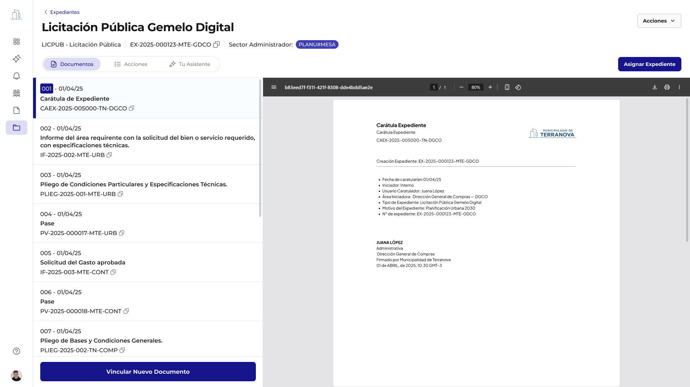

# Flujo de Creación de Expedientes

El proceso de creación de un expediente en GDI está diseñado para ser intuitivo y guiar al usuario a través de los pasos necesarios para iniciar un nuevo trámite. Este flujo establece la base del expediente, generando su carátula y asignando los datos iniciales.

## 3.1 Inicio y Configuración (Tipo, Motivo, Iniciador)

### Inicio de la Creación

El usuario inicia el proceso seleccionando el Tipo de Expediente desde un catálogo predefinido (campo Dropdown). Esta selección es obligatoria y depende de la configuración de tipos de expediente definida por el superadministrador en el Backoffice.

> Para más detalles sobre cómo se configuran los Tipos de expedientes, ver sección: Backoffice – Configuración de Expedientes.

### 1. Selección del Tipo de Expediente

Campo desplegable (Dropdown) que muestra un listado de opciones habilitadas de acuerdo al tipo de usuario.

**Listado Dinámico y Filtrado**: Este listado muestra únicamente los tipos de expediente que el Super-Administrador habilitó y configuró en Backoffice, sección "Tipo de Expediente". Allí también se definen las reparticiones autorizados para caratular cada uno.

**Ejemplo**: Si el tipo de expediente "Licitación Pública" está configurado para repartición caratuladora específica "Dirección de Compras", cualquier usuario puede crear este tipo de expediente, pero la carátula oficial siempre se asignará a la "Dirección de Compras".

### 2. Definición del Motivo

Se ingresa un Motivo (campo Textarea) que justifica la creación del expediente. Este campo es condicionalmente obligatorio, campo de texto libre (200 caracteres).

### 3. Determinación del Tipo de Inicio

El usuario define el Tipo de Inicio del expediente (campo Tab selector), seleccionando entre "Municipalidad" o "Vecino" (Trámite Interno o Externo). Esta elección es clave porque condiciona qué datos deben completarse a continuación:

### Información del Solicitante (Condicional según Tipo de Inicio):

#### Si el Tipo de Inicio es "Externo"

- Se solicita el **Nro de Identificación Fiscal** (CUIT, CUIL o correspondiente según país) del solicitante (campo Text Input). Este campo es obligatorio y sirve como identificador del expediente con el iniciador externo.

- Se solicita el **Nombre o Razón Social del Iniciador** (campo Auto-complete (readonly)). Este campo se autocompleta mediante una API de validación, asegurando la veracidad de la información del iniciador externo.

#### Si el Tipo de Inicio es Municipalidad o Interno:

Los campos Nro de Identificación Fiscal (CUIT, CUIL) del solicitante y Nombre o Razón Social del Iniciador no se solicitan al usuario, ya que la información del iniciador se obtiene directamente del usuario interno que caratula.

## 3.2 Generación Automática de Carátula (con firma automática)

Una vez completados los datos requeridos, el sistema genera automáticamente la carátula del expediente en formato PDF, consolidando toda la información inicial ingresada.

Al crear un expediente, el sistema genera automáticamente una carátula tipo documento PDF que reúne los datos esenciales del trámite y formaliza su creación dentro del sistema.

### Proceso Automático Backend:

1. **Validación de datos**: Verificación de completitud de campos obligatorios
2. **Generación de número oficial**: Consulta al servicio OFICIAL NUMBER para asignar EX-AAAA-NNNNNN-SIGLA_ECO-SIGLA_REP
3. **Creación del PDF**: Renderizado automático de la carátula con todos los datos
4. **Firma automática**: Inclusión de la firma digital del usuario creador sin intervención manual
5. **Persistencia**: Almacenamiento del expediente y carátula en el sistema

### Información generada automáticamente en la Carátula:

#### Encabezado:
- **Título**: Carátula de Expediente
- **Carátula de Expediente (CAEX)** – Número de documento: CAEX-AAAA-NNNNNN-SIGLA_ECO_SIGLA_REP (Ej. CAEX-2025-005000-TN-DGCO)
- **Lugar y fecha**: Nombre oficial, DD de MMMM de AAAA (Ej. Terranova, 03 de mayo de 2025)
- **Número de expediente**: EX-AAAA-NNNNNN-SIGLA_ECO-SIGLA_REP (Ej. EX-2025-001000-TN-DGCO)

#### Datos del Expediente:
- **Fecha de caratulación**: Fecha del sistema al crear el expediente (Ej. 03/05/2025)
- **Iniciador**: Origen del trámite, interno (municipio) o externo (vecino) (Ej. Interno (Dirección de Sistemas))
- **Usuario caratulador**: Nombre y apellido de quien inicia el expediente (Ej. Juana López)
- **Área iniciadora**: Reparticiones habilitadas para iniciar el expediente. Pueden ser "Todas" o "Múltiples áreas" (Definido en BackOffice por cada Tipo de Expediente) (Ej. Dirección general de Compras DGCO)
- **Tipo de expediente**: Opción seleccionada al crearlo (Ej. Licitación Pública)
- **Motivo del expediente**: Texto libre ingresado por el usuario (Ej. Licitación Pública Gemelo Digital)
- **Número de expediente**: Identificador automático con formato estándar (Ej. EX-2025-001000-TN-DGCO)

Firma digital automática:  
Firmante: Nombre, Sello (cargo) y repartición(Ej. Juana López, Jefa de Departamento, Dirección General de Compras)  
Validación: Sello digital con fecha y hora (Ej. Municipalidad de Terranova – 03/05/2025 10:30:00 GMT-3)  

Lógica de Asignación de Repartición Caratuladora  
La capacidad de un usuario para crear la carátula de un expediente no es universal, y la repartición caratuladora numeradora puede no ser la misma que la del usuario creador. Depende directamente de la configuración del Backoffice:  

- **Habilitación para Crear:** Un usuario solo podrá iniciar la creación de un expediente si su repartición está incluida en la configuración de Reparticiones Habilitadas para Caratular para el Tipo de Expediente seleccionado.  
- **Asignación de Repartición Caratuladora:** Una vez que el expediente es creado, la Repartición Caratuladora se asigna automáticamente según la configuración del Backoffice para ese tipo de expediente, lo que puede diferir de la repartición del usuario creador.  

#### Ejemplo Ilustrativo: Licitación Pública 

Consideremos el tipo de expediente "Licitación Pública" (LICPUB):

- **Reparticiones Habilitadas para Caratular**: Todas
- **Repartición Caratuladora**: Específica -> "Dirección de Compras"

Aunque un usuario de la "Secretaría de Hacienda" pueda iniciar la creación de un expediente de "Licitación Pública", las siglas del número oficial de ese expediente siempre se asignará a la "Dirección de Compras" al igual que la administración. Esto asegura que los expedientes de Licitación Pública sean formalmente gestionados por la repartición competente, independientemente de quién los haya iniciado.

La propiedad del expediente queda asignada a la repartición caratuladora como repartición administradora pero puede transferirse luego desde el panel de acciones. A su vez, si la repartición/sector iniciadora no es la caratulado, se agrega automáticamente una solicitud de actuación al iniciador.