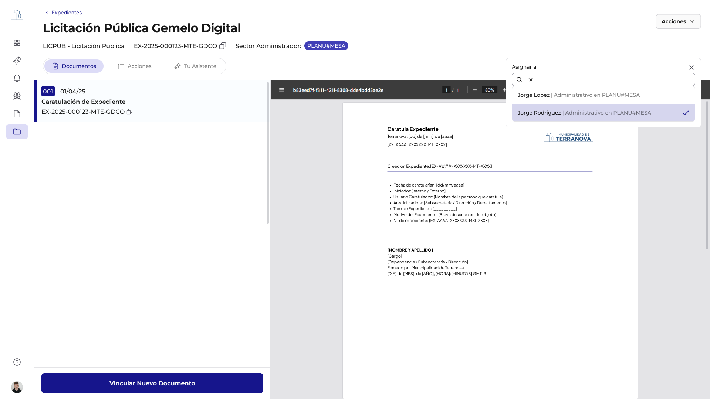
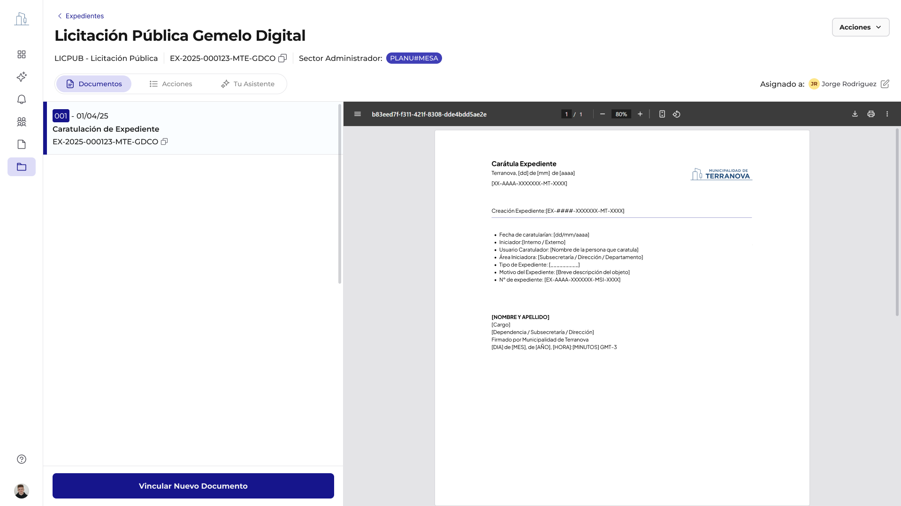
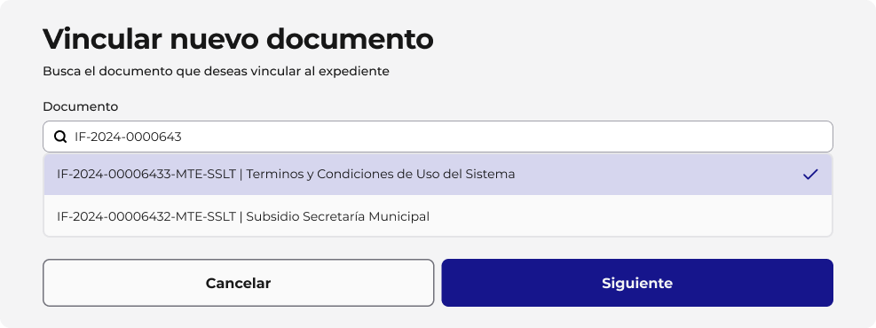
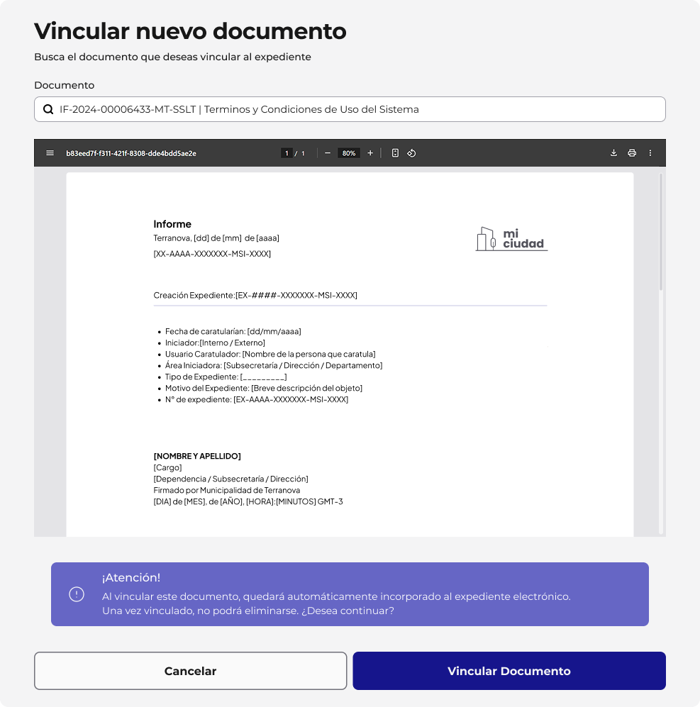
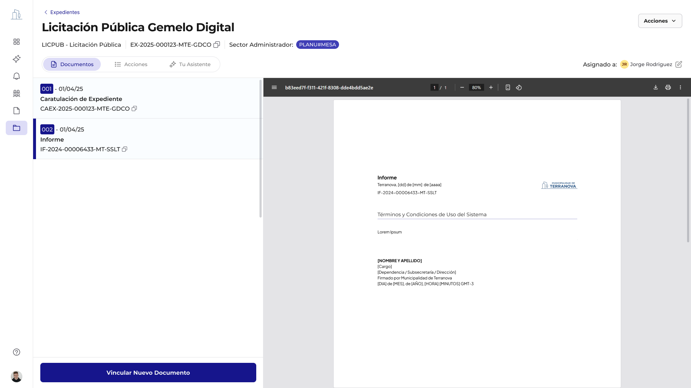
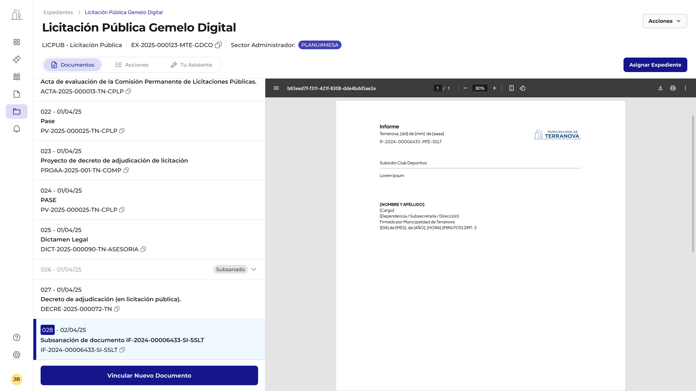
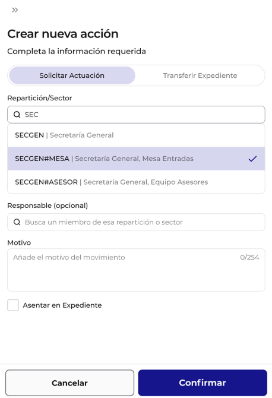
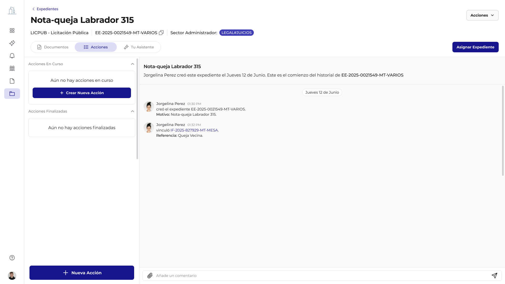
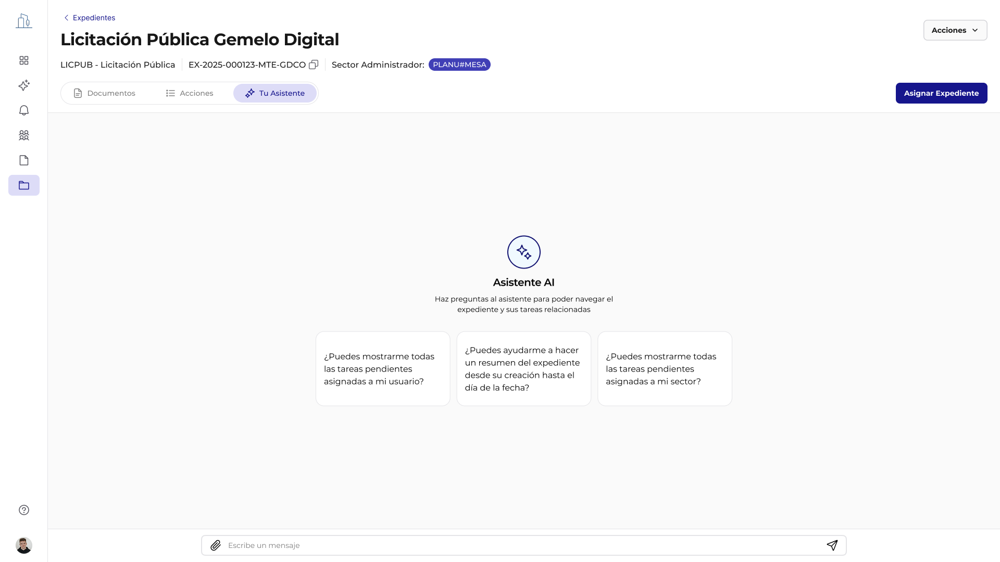

## 3.3 Gestión Operativa del Expediente

Una vez creado el expediente, el usuario accede a una vista estructurada en tres secciones principales, cada una con funcionalidades específicas para gestionar el ciclo de vida del trámite.

El expediente entra inmediatamente en su fase operativa, donde los usuarios autorizados pueden:

- Vincular documentos al expediente
- Crear solicitudes de actuación a otros sectores
- Asignar responsables dentro de la repartición
- Consultar con el asistente AI
- Transferir la propiedad del expediente

### Asignación de Expedientes

🎨 **Flujo en Figma:** [Asignación de Expedientes](https://www.figma.com/design/QfYxAIYk97ZzvIU411ryLh/GDI---Expedientes?node-id=6796-14077&t=xkPc1JncRGCA4nzR-4)

La funcionalidad de Asignar Expediente en GDI es una característica clave que potencia la colaboración y la eficiencia en la gestión. Permite designar un responsable dentro de la repartición administradora para el seguimiento y gestión de un expediente. Es un dato informal que fundamentalmente propicia designar un responsable de tramitación.

**Proceso de asignación**:

1. **Acceso a la opción de asignación**: Desde la vista del expediente, el usuario puede acceder a la opción de "Asignar" el expediente

2. **Búsqueda y selección de usuarios**: Se presenta una interfaz donde se puede buscar y seleccionar al usuario que desea asignar el expediente. El sistema permite buscar por nombre o rol

3. **Confirmación de asignación**: Una vez seleccionados el usuario, se confirma la asignación. Esto no tiene impacto formal en el expediente

## 4. Secciones Funcionales del Expediente

### 4.1 Sección Documentos

Esta pestaña permite visualizar y gestionar todos los documentos vinculados que conforman el expediente, en orden cronológico. Cada documento está ordenado según orden de vinculación.

#### Funciones destacadas:

- **Visualización secuencial** de los documentos vinculados en orden cronológico
- **Acceso directo** al visor de documentos (formato PDF)
- **Identificación** por tipo, fecha y número
- **Botón "Vincular nuevo documento"** para agregar nuevos registros al expediente
- **Botón Acciones** donde se encuentra la opción de Subsanar documento, descargar documento y también "vincular"
- **Asignación de expediente** a usuarios

#### 4.1.1 Vinculación de documentos

🎨 **Flujo en Figma:** [Vinculación de Documentos](https://www.figma.com/design/QfYxAIYk97ZzvIU411ryLh/GDI---Expedientes?node-id=6803-9806&t=xkPc1JncRGCA4nzR-4)

**Proceso**: Desde la vista detallada del expediente, el usuario puede iniciar la acción de "Vincular Documento". Se abre una interfaz que permite buscar y seleccionar documentos ya existentes en GDI.

Una vez seleccionado el documento se abre una previsualización del número de documento seleccionado y una vez confirmado quedan asociados al expediente, manteniendo su trazabilidad y versiones.

**Propósito**: Asociar documentos existentes (gestionados por el Módulo Documentos) al expediente, enriqueciendo su contenido y proporcionando la información necesaria para su tramitación.

**Impacto**: Los documentos vinculados se visualizan dentro del expediente en orden cronológico de su vinculación, formando parte de su contenido integral.

#### 4.1.2 Subsanación de documentos

🎨 **Flujo en Figma:** [Subsanación de Documentos](https://www.figma.com/design/QfYxAIYk97ZzvIU411ryLh/GDI---Expedientes?node-id=6803-13855&t=xkPc1JncRGCA4nzR-4)

**Propósito**: Permite reemplazar un documento previamente vinculado al expediente, manteniendo un registro. Esto es crucial para corregir errores sin perder el historial, los errores existirán y se deben poder corregir. Se debe vincular un documento para justificar la acción.

**Proceso**:
1. Desde el botón superior de "Acciones", el usuario puede seleccionar un documento y optar por "Subsanar"
2. Se le guiará para cargar la nueva versión del documento

**Impacto**: El documento original vinculado cambia su estado a SUBSANADO, y la justificación se vincula al expediente, asegurando la integridad del historial.

#### 4.1.3 Descarga del Documento (en cualquier etapa)

**Propósito**: Permitir a los usuarios descargar una copia del expediente en formato PDF en cualquier momento del proceso.

**Proceso**: Una funcionalidad de "Descargar" está disponible en la sección "acciones", permitiendo obtener un archivo .zip con todo el expediente.

### 4.2 Sección Acciones

La sección de "Acciones" dentro del Módulo de un Expediente es el centro neurálgico para la gestión dinámica y colaborativa de los trámites. Permite a los usuarios iniciar y gestionar diversas actividades que impulsan el expediente a través de sus diferentes etapas, asegurando la comunicación y la coordinación entre las distintas áreas involucradas.

Desde esta área, el usuario puede visualizar el historial de acciones, las acciones en curso y las acciones finalizadas, proporcionando una visión completa del progreso del expediente.

#### 4.2.1 Solicitud de Actuación: Requerimientos Inter-áreas

🎨 **Flujo en Figma:** [Solicitud de Actuación](https://www.figma.com/design/QfYxAIYk97ZzvIU411ryLh/GDI---Expedientes?node-id=7203-8422&t=xkPc1JncRGCA4nzR-4)

La funcionalidad de "Solicitar Actuación" es una herramienta fundamental para la coordinación entre sectores. Permite a un usuario requerir una acción específica a un sector determinado, asegurando que las tareas necesarias para el avance del expediente sean ejecutadas de manera eficiente.

**Proceso de solicitud de actuación**:

1. **Inicio de una nueva acción**: desde la sección "Acciones" del expediente, el usuario selecciona la opción "Crear nueva acción". Esto abre un formulario para configurar la solicitud.

2. **Selección de "Solicitar Actuación"**:

   - **Definición de la Repartición #Sector Requerido**: El usuario debe especificar el la Repartición#Sector al que se dirige la solicitud. El sistema ofrece un campo de búsqueda (Sector) que permite encontrar y seleccionar el sector deseado (ej., "SECGEN | Secretaría General, Privada.", "SECGEN#MESA | Secretaría General, Mesa Entradas").

   - **Asignación de Responsable (Opcional)**: el usuario puede asignar la actuación a un Responsable específico dentro del sector seleccionado a través de un campo de búsqueda que permite encontrar miembros de dicho sector.

   - **Especificación del Motivo**: Es obligatorio añadir un Motivo (Motivo) que describa claramente el propósito de la solicitud de actuación (ej., "Añade el motivo del movimiento"). Este campo tiene un límite de caracteres (0/254).

   - **Asentar en Expediente (Opcional)**: El usuario puede optar por "Asentar en Expediente" la solicitud, lo que significa que esta acción de solicitud quedará registrada formalmente en los documentos del expediente. Como un "Pase en Paralelo", "Providencia Interna" o el tipo correspondiente según definición en BackOffice. Si es asentada en la "ida" será asentada la "vuelta", toda "Solicitar Actuación" deberá tener cierre.

   - **Confirmación de la Solicitud**: Una vez completados los campos, el usuario confirma la solicitud. El sistema registra la actuación y la notifica en el panel de expedientes al sector y responsable designado.

#### 4.2.2 Transferencia de expediente: cambio de propiedad y responsabilidad

La funcionalidad de **Transferir expediente** es una acción crítica dentro del Módulo Expediente que permite cambiar la propiedad y, por ende, la responsabilidad principal de un expediente de una repartición o usuario a otro. Esta acción es fundamental para la correcta gestión de los flujos de trabajo que requieren un cambio formal en la titularidad del trámite.

No es solo una reasignación de tareas, sino un cambio formal en la entidad (repartición#sector) la responsabilidad principal sobre el expediente. Esto asegura que el control y la gestión del expediente recaigan en la unidad administrativa correcta en cada etapa de su ciclo de vida.

La transferencia se realiza mediante el mismo proceso que la solicitud de actuación, utilizando la funcionalidad **"Nueva acción"** desde la pestaña de Acciones. La diferencia radica en el motivo y la intención de la acción: en este caso, se explicita que el expediente pasará a ser gestionado por la nueva repartición/sector asignada perdiendo la reparticion-sector emisora los permisos sobre el expediente.

#### Panel de acciones

Una vez realizada la solicitud de actuación, esta queda registrada en el panel de Acciones, desde donde se puede hacer seguimiento en tiempo real. El usuario puede ver:

- **Acciones en curso**: todas las solicitudes activas enviadas a otras reparticiones, con opción de finalizarlas una vez respondidas
- **Tareas finalizadas**: solicitudes ya resueltas, archivadas para consulta
- **Historial completo**: listado cronológico de todas las acciones, usuarios involucrados, fechas y comentarios intercambiados

### 4.3 Sección Asistente AI

🎨 **Flujo en Figma:** [Asistente AI](https://www.figma.com/design/QfYxAIYk97ZzvIU411ryLh/GDI---Expedientes?node-id=6803-14625&t=xkPc1JncRGCA4nzR-4)

El Asistente de IA integrado en cada expediente transforma la manera en que los usuarios interactúan con la información y gestionan sus trámites. Esta funcionalidad nativa de inteligencia artificial permite una consulta conversacional, resúmenes rápidos y la identificación de tareas pendientes, optimizando la eficiencia y la toma de decisiones.

Es una interfaz conversacional que utiliza procesamiento de lenguaje natural para entender las consultas de los usuarios y proporcionar respuestas relevantes basadas en el contenido y el estado del expediente. Actúa como un copiloto inteligente, facilitando el acceso a la información y la ejecución de tareas.

#### Interfaz del Asistente de IA:

La interfaz del Asistente de IA se presenta como un chat, donde el usuario puede escribir sus preguntas y recibir respuestas. Se ofrecen sugerencias de preguntas frecuentes para facilitar la interacción inicial (ej., "¿Puedes mostrarme todas las tareas pendientes asignadas a mi usuario?", "¿Puedes ayudarme a trazar un resumen del expediente y su situación al día de la fecha?"). Es un chat privado entre el Agente y el usuario, cada usuario tiene su propia conversación.