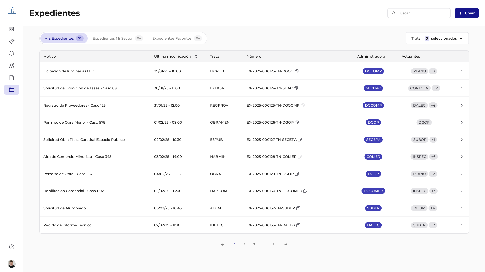

# Panel de Expedientes y Navegación

El Panel de Expedientes es la interfaz principal del Módulo Expediente, diseñada para ofrecer a los usuarios una visión integral y organizada de todos los trámites activos en el sistema.

Su estructura en forma de tabla facilita la lectura rápida y ordenada de la información clave de cada expediente, permitiendo una gestión eficiente y un acceso ágil a los detalles necesarios.

## Navegación por pestañas: vistas personalizadas

El Panel de Expedientes organiza la información en pestañas intuitivas, proporcionando vistas personalizadas que se adaptan a las necesidades y roles de cada usuario. Esto mejora la usabilidad y permite un acceso rápido a los expedientes más relevantes para el trabajo diario.

### 1. Mis Expedientes:

Esta pestaña muestra todos los expedientes donde el usuario es responsable del expediente al haber sido asignado como tal para su totalidad o una actuación específica. Es la vista predeterminada para la mayoría de los usuarios, ya que centraliza los trámites de los que son directamente responsables. Además aparecerán todos los marcados como "favorito".

Permite un seguimiento directo de los expedientes que requieren su atención y gestión activa.

### 2. Expedientes de mi sector:

Esta pestaña ofrece una vista compartida de todos los expedientes asociados al sector o repartición del usuario sea porque es el administrador o se le solicitó una actuación.

Facilita la coordinación y el trabajo en equipo, asegurando que todos los miembros del sector tengan acceso y visibilidad sobre los expedientes en curso.

### 3. Expedientes Favoritos:

Esta funcionalidad permite a los usuarios guardar manualmente expedientes específicos para un seguimiento frecuente y rápido. Los expedientes marcados como favoritos aparecen en esta pestaña, independientemente de su estado o propietario.

Es una herramienta de personalización que mejora la eficiencia al permitir un acceso directo a los expedientes más consultados o de alta prioridad para el usuario.

