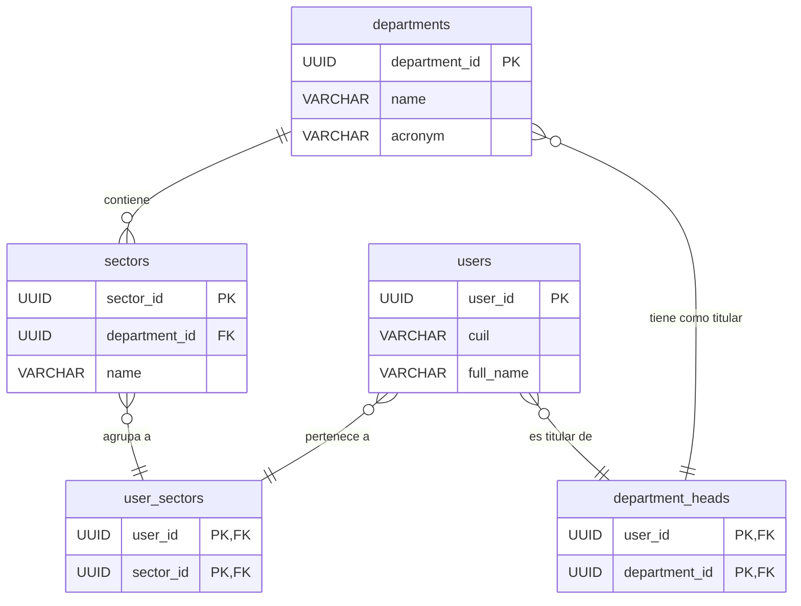

1
# 🏛️ Estructura Organizacional: Modelo Conceptual y Técnico

Este documento define la estructura organizacional jerárquica de GDI, detallando tanto el modelo conceptual como su implementación técnica en la base de datos.

## 1. Composición Jerárquica

GDI organiza la estructura en tres niveles principales, partiendo del organismo municipal:

```
ORGANISMO
├── REPARTICIONES (Secretarías/Direcciones)
│   ├── SECTORES (Departamentos/Áreas)
│   │   └── USUARIOS (Empleados/Funcionarios)
```

---

## 2. Diagrama del Modelo de Datos (ERD)

El siguiente diagrama muestra las relaciones entre las tablas principales del organigrama.



---

## 3. Entidades Principales y Modelo de Datos

A continuación se detalla el modelo de datos técnico para cada entidad, junto con la explicación conceptual de su rol en el organigrama.

### 3.1 Reparticiones (`departments`)

**Rol Conceptual:** Representa las grandes áreas funcionales del municipio, como Secretarías o Direcciones Generales (ej: Secretaría de Gobierno, Dirección de Obras Públicas). Cada repartición tiene un **Titular** y se identifica con un **Acrónimo** único para su uso en todo el sistema.

**Implementación Técnica:**
```sql
-- Tabla para las reparticiones (nivel 1 de la jerarquía)
CREATE TABLE departments (
    department_id UUID PRIMARY KEY DEFAULT gen_random_uuid(),
    name VARCHAR(255) NOT NULL,
    acronym VARCHAR(20) NOT NULL UNIQUE,
    created_at TIMESTAMP WITH TIME ZONE DEFAULT NOW(),
    updated_at TIMESTAMP WITH TIME ZONE DEFAULT NOW(),
    is_active BOOLEAN DEFAULT true
);
```

**Columnas Detalladas:**
- `department_id`: (PK) Identificador único de la repartición.
- `name`: Nombre completo y descriptivo (ej: "Secretaría de Hacienda").
- `acronym`: Sigla única y corta para la repartición (ej: "SECHAC"). Se utiliza en la nomenclatura de documentos y expedientes.
- `is_active`: Flag para activaciones o desactivaciones lógicas de la repartición.

### 3.2 Sectores (`sectors`)

**Rol Conceptual:** Son las subdivisiones funcionales dentro de cada repartición, como Departamentos, Áreas o Mesas de Entrada (ej: Departamento de Personal, Área de Sistemas). Cada sector pertenece a una única repartición.

**Implementación Técnica:**
```sql
-- Tabla para los sectores (nivel 2 de la jerarquía)
CREATE TABLE sectors (
    sector_id UUID PRIMARY KEY DEFAULT gen_random_uuid(),
    department_id UUID NOT NULL REFERENCES departments(department_id) ON DELETE CASCADE,
    name VARCHAR(255) NOT NULL,
    acronym VARCHAR(20) NOT NULL,
    created_at TIMESTAMP WITH TIME ZONE DEFAULT NOW(),
    updated_at TIMESTAMP WITH TIME ZONE DEFAULT NOW(),
    is_active BOOLEAN DEFAULT true,
    UNIQUE(department_id, acronym) -- El acrónimo del sector es único dentro de su repartición
);
```
**Columnas Detalladas:**
- `sector_id`: (PK) Identificador único del sector.
- `department_id`: (FK) Vincula el sector a su repartición padre.
- `name`: Nombre completo y descriptivo (ej: "Departamento de Tesorería").
- `acronym`: Sigla única **dentro de su repartición** (ej: "TESO").

### 3.3 Usuarios (`users`)

**Rol Conceptual:** Representa a cada individuo (empleado o funcionario) que interactúa con el sistema. Cada usuario está vinculado a uno o más sectores y se le asignan roles que definen sus permisos.

**Implementación Técnica:**
```sql
-- Tabla central de usuarios, extiende la tabla auth.users de Supabase
CREATE TABLE users (
    user_id UUID PRIMARY KEY REFERENCES auth.users(id) ON DELETE CASCADE,
    cuil VARCHAR(11) NOT NULL UNIQUE,
    full_name VARCHAR(255) NOT NULL,
    email VARCHAR(255) NOT NULL UNIQUE,
    phone_number VARCHAR(50),
    avatar_url TEXT,
    is_active BOOLEAN DEFAULT true,
    created_at TIMESTAMP WITH TIME ZONE DEFAULT NOW(),
    updated_at TIMESTAMP WITH TIME ZONE DEFAULT NOW()
);
```
**Columnas Detalladas:**
- `user_id`: (PK/FK) Vinculado directamente al sistema de autenticación de Supabase.
- `cuil`: Clave Única de Identificación Laboral, identificador principal de la persona.
- `full_name`, `email`, `phone_number`, `avatar_url`: Datos de perfil del usuario.
- `is_active`: Permite la suspensión o activación de usuarios en el sistema.

### 3.4 Relaciones de Pertenencia y Titularidad

Para gestionar las complejas relaciones de pertenencia y responsabilidad, se utilizan tablas de unión (junction tables).

#### Tabla de Unión: `user_sectors`
Define a qué sector o sectores pertenece un usuario.

```sql
-- Tabla de unión para la relación N:M entre usuarios y sectores
CREATE TABLE user_sectors (
    user_id UUID NOT NULL REFERENCES users(user_id) ON DELETE CASCADE,
    sector_id UUID NOT NULL REFERENCES sectors(sector_id) ON DELETE CASCADE,
    -- Timestamps para auditoría de la asignación
    assigned_at TIMESTAMP WITH TIME ZONE DEFAULT NOW(),
    PRIMARY KEY (user_id, sector_id)
);
```

#### Tabla de Unión: `department_heads`
Define qué usuario es el titular de una repartición.

```sql
-- Tabla de unión para la relación N:M entre usuarios (titulares) y reparticiones
CREATE TABLE department_heads (
    user_id UUID NOT NULL REFERENCES users(user_id) ON DELETE CASCADE,
    department_id UUID NOT NULL REFERENCES departments(department_id) ON DELETE CASCADE,
    -- Timestamps para auditoría de la designación
    designated_at TIMESTAMP WITH TIME ZONE DEFAULT NOW(),
    PRIMARY KEY (user_id, department_id)
);
```

---

## 4. Reglas de Negocio Fundamentales

Aquí se definen las reglas críticas que gobiernan el comportamiento del organigrama.

### [REGLA_NEGOCIO: ESTRUCTURA_JERÁRQUICA]
**RN001: Jerarquía Obligatoria**
- Todo usuario DEBE pertenecer a, al menos, un sector. *(Implementado a través de la tabla `user_sectors`)*.
- Todo sector DEBE pertenecer a una repartición. *(Implementado con la `FOREIGN KEY` `department_id` en la tabla `sectors`)*.
- Una repartición puede tener múltiples sectores.
- Un sector puede tener múltiples usuarios.
- Un usuario puede pertenecer a múltiples sectores. *(Relación Muchos a Muchos gestionada por `user_sectors`)*.

### [REGLA_NEGOCIO: TITULARIDAD]
**RN002: Asignación de Titulares**
- Cada repartición PUEDE tener uno o más titulares asignados.
- Un usuario puede ser titular de múltiples reparticiones. *(Relación Muchos a Muchos gestionada por `department_heads`)*.
- Solo los titulares pueden gestionar usuarios y configuraciones de su repartición. *(Lógica a implementar en la capa de aplicación/API)*.

### [REGLA_NEGOCIO: UNICIDAD]
**RN003: Identificadores Únicos**
- `cuil` de usuario debe ser único en todo el sistema. *(Constraint `UNIQUE` en la tabla `users`)*.
- `email` de usuario debe ser único en todo el sistema. *(Constraint `UNIQUE` en la tabla `users`)*.
- `acronym` de repartición debe ser único. *(Constraint `UNIQUE` en la tabla `departments`)*.
- `acronym` de sector debe ser único **dentro de su repartición**. *(Constraint `UNIQUE(department_id, acronym)` en la tabla `sectors`)*.

### [REGLA_NEGOCIO: PERMISOS_GESTIÓN]
**RN004: Gestión de Usuarios**
- Solo los titulares (`department_heads`) pueden dar de alta, baja o suspender usuarios.
- Los titulares solo pueden gestionar usuarios que pertenezcan a sectores de su propia repartición.
- Todos los usuarios pueden consultar el organigrama.
